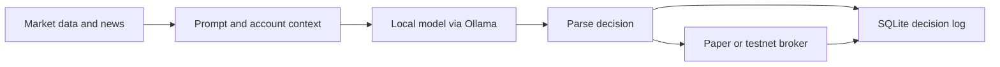

# AI Trading Tool

An experimental Python project connecting a local language model to market data, news, and broker APIs. It explores how to turn model responses into structured decisions and record the results in SQLite.

The stock broker targets Alpaca's paper API; the cryptocurrency broker targets Binance Spot Testnet. Decision scripts can submit simulated orders to those services.

## Workflow



## Setup

Requires Python 3, a running Ollama service with a locally available model, and credentials for the services you intend to use.

```bash
git clone https://github.com/Akrouma03/AI-Trading-Tool.git
cd AI-Trading-Tool
python -m venv .venv
```

Activate the environment using `.venv\Scripts\Activate.ps1` in PowerShell or `source .venv/bin/activate` on macOS/Linux, then install dependencies:

```bash
python -m pip install requests python-dotenv
```

Create a local `.env` file with the relevant credentials:

```dotenv
ALPACA_API_KEY=your_paper_api_key
ALPACA_SECRET_KEY=your_paper_secret_key
BINANCE_API_KEY=your_testnet_api_key
BINANCE_SECRET_KEY=your_testnet_secret_key
FINNHUB_API_KEY=your_news_api_key
```

In `config.py`, set `MODEL` to a model installed in Ollama and check `OLLAMA_URL`, the configured symbols and other settings before running. Use paper/testnet credentials for the broker endpoints above. Keep `.env` local.

## Entry points

```bash
python decision.py         # stock decision pass
python crypto_decision.py  # cryptocurrency decision pass
python watch_crypto.py     # cryptocurrency passes every five minutes
```

These commands call external services and can place paper/testnet orders. Stop the watcher with Ctrl+C. Decisions are stored in `trades.db`.

## Project map

| Files | Purpose |
| --- | --- |
| `decision.py`, `crypto_decision.py` | Build prompts and process decisions. |
| `ollama_client.py` | Call the local model. |
| `market_data.py`, `crypto_data.py`, `news_data.py` | Retrieve market inputs. |
| `broker.py`, `crypto_broker.py` | Connect to paper/testnet brokers. |
| `db.py`, `check_outcomes.py` | Store records and inspect outcomes. |
| `watch_crypto.py` | Repeat cryptocurrency decision passes. |

## Current limitations

This repository is an integration experiment, not evidence of a profitable strategy. Model output and external API availability can vary. A reproducible benchmark, automated test suite and pinned dependency set remain future improvements.